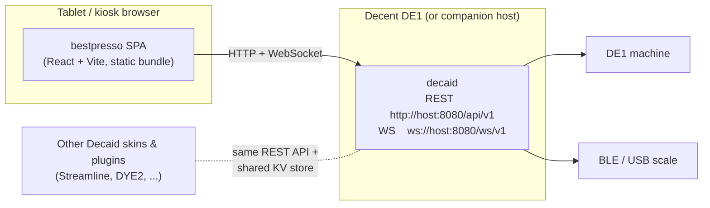
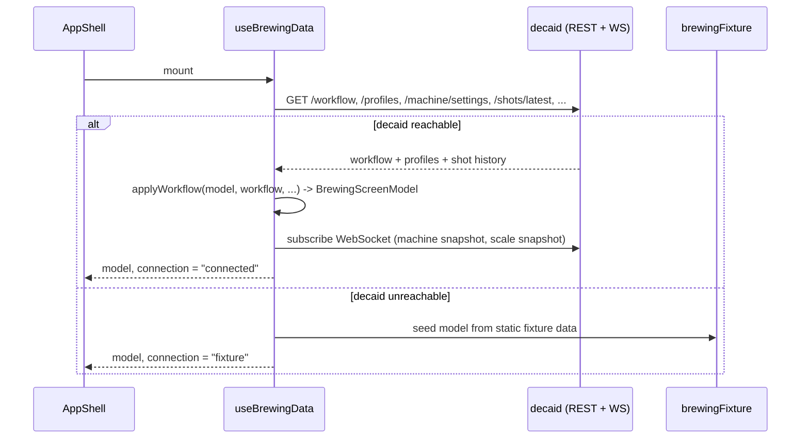
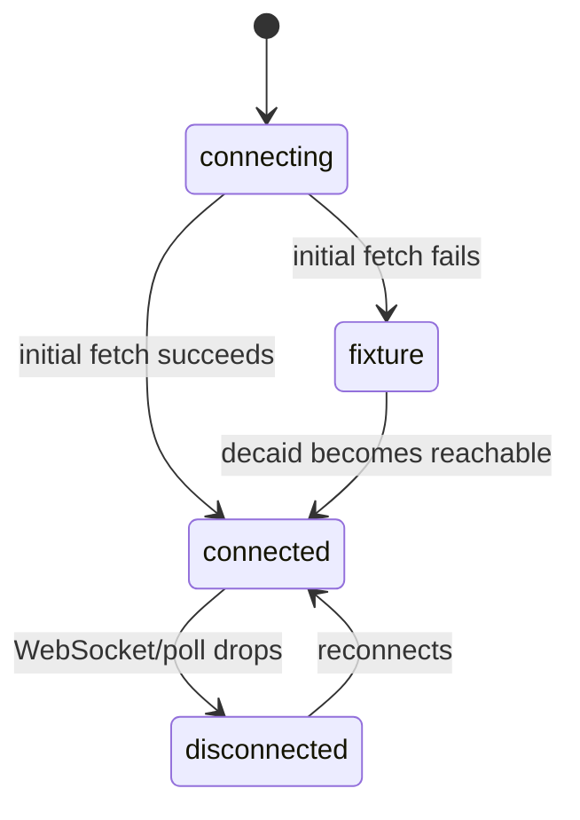
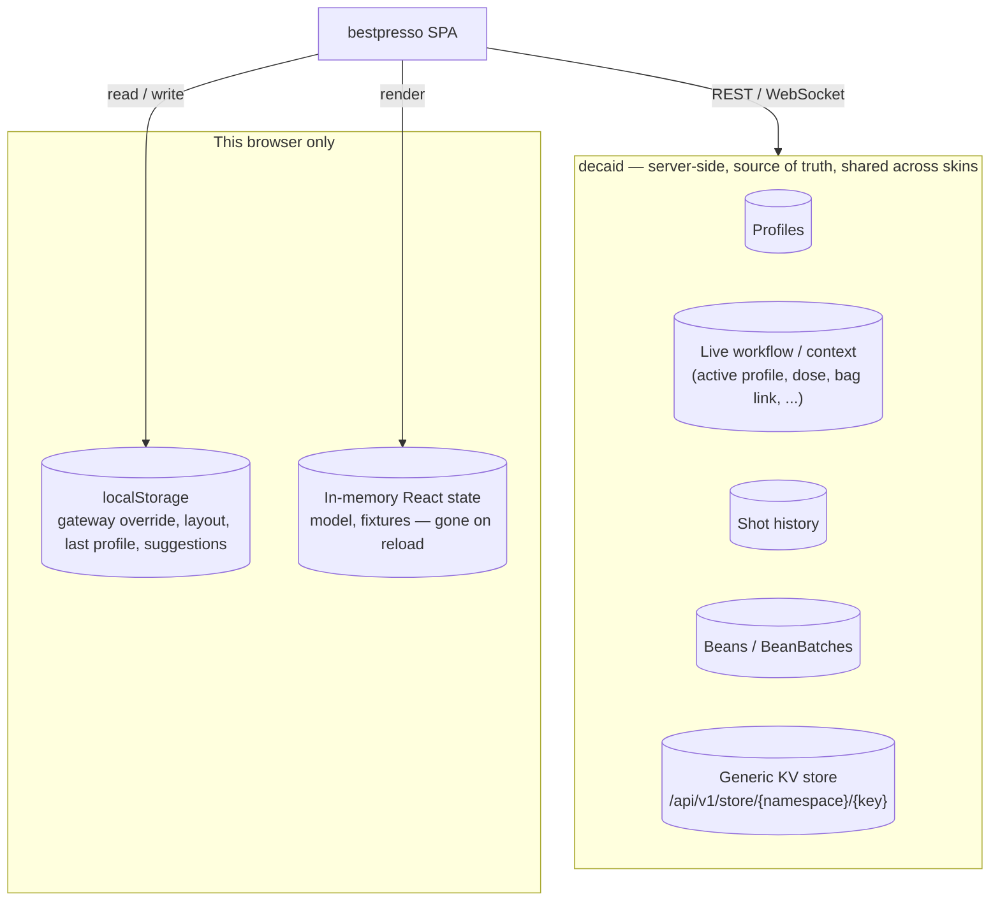
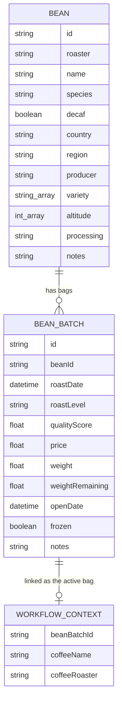
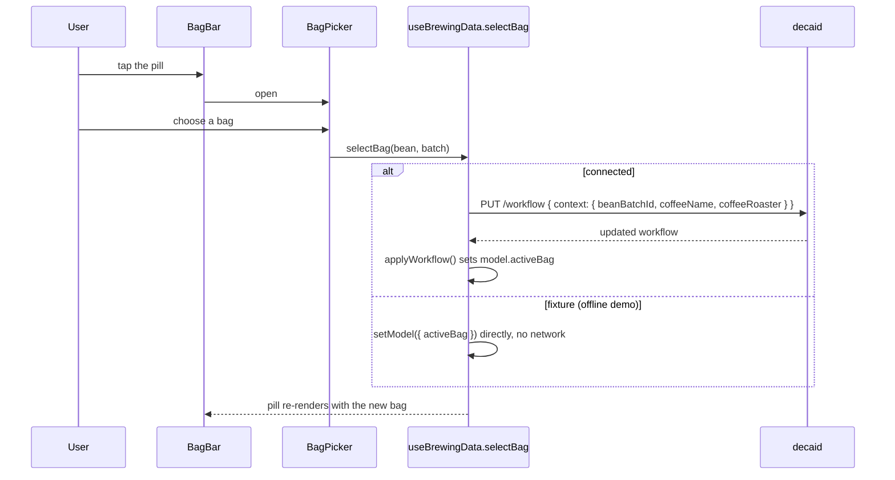
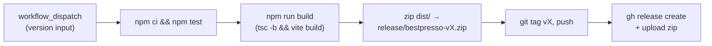

# Architecture

Bestpresso is a **Decaid skin**: a single-page React app with no backend of
its own. Every fact about the machine, the scale, brew profiles, shot
history, and (as of the Bag feature) coffee beans lives on **decaid**, the
REST/WebSocket service that runs on or near the DE1 and that every skin
(Streamline, DYE2, Bestpresso, ...) talks to. Bestpresso's job is to render
that state well and, when decaid is unreachable, keep working from a static
fixture so the UI is still demoable.

This document describes the moving parts and — the part that's easy to get
wrong — **where data actually lives**: what decaid owns, what only ever
lives in this browser, and what is thrown away on reload.

## System context

Bestpresso never talks to the machine or the scale directly, and it never
opens a second server — `decaid` is the only thing it depends on, at
`window.location.hostname` by default (`src/api/decaid/config.ts`), with a
per-browser override (see [Local, per-browser storage](#local-per-browser-storage)).

## Source layout

| Path | Owns |
|---|---|
| `src/domain/` | Framework-free types and pure functions: `brewing.ts` (the shared `BrewingScreenModel`, connection/readiness types), `bag.ts` (Bean/BeanBatch types + freshness/grouping logic), `layout.ts`, `scales.ts`, `valueAdjustments.ts`. No imports from React or `src/api`. |
| `src/api/decaid/` | Everything that knows decaid's wire format: `config.ts` (gateway resolution), `client.ts` (thin `fetch` wrappers, one per REST endpoint), `socket.ts` (reconnecting WebSocket subscription), `adapters.ts` (decaid JSON → domain model), `readiness.ts` (the ready/heating/not-heating state machine), `profileWorkflow.ts`, `types.ts` (decaid's wire types). |
| `src/features/<name>/` | One folder per screen/surface (`brew`, `bag`, `profiles`, `cleaning`, `history`, `machine`, `sleep`), each usually a component plus the pure logic it needs (e.g. `brew/profileCarouselMotion.ts`, `bag/useBagData.ts`). `features/brew/useBrewingData.ts` is the exception: the one big hook that owns live state for the whole dashboard. |
| `src/app/AppShell.tsx` | Composes the dashboard: utility cards + `BrewingPanel` + overlays (scale picker, cleaning picker, bag picker/form). Pure prop-drilling, no data fetching of its own. |
| `src/App.tsx` | Top-level router (`?page=`) and the one place `useBrewingData()` and `useBagData()` are called. |
| `src/fixtures/` | Static data used when decaid can't be reached (`brewingFixture.ts`, `scaleFixtures.ts`) — see [Fixture / offline mode](#fixture--offline-mode). |
| `src/components/` | Reusable, decaid-agnostic UI primitives (`Metric`, `StatusPill`, the value-adjustment ruler, fullscreen handling). |
| `src/styles/index.css` | One global stylesheet; no CSS modules. |

## Data flow: how a screen gets its data

`useBrewingData()` (`src/features/brew/useBrewingData.ts`) is the app's only
data-fetching hook for the dashboard. It is called once, in `App.tsx`, and
its returned `model: BrewingScreenModel` plus a large set of action
callbacks (`selectProfile`, `selectBag`, `toggleSleep`, ...) flow down
through `AppShell` as props — nothing else in the tree fetches on its own.

`applyWorkflow` (`src/api/decaid/adapters.ts`) is the single place that
turns a raw decaid `Workflow` response into model fields — it derives
`activeProfileId`, the utility-card readings, and (since the Bag feature)
`activeBag`. Every one of the ~9 places in `useBrewingData.ts` that
re-fetches or patches the workflow calls `applyWorkflow` again, so adding a
field there (as the Bag feature did) automatically reaches every call site.

### Connection states

`fixture` is sticky on purpose: once the app has fallen back to static demo
data it stays there (rather than flapping to `disconnected`) until a real
decaid connection actually succeeds. The status pill shows this as **Ready /
Heating / ... / Demo**.

## Where data is stored

Three tiers, in order of how durable they are:

### 1. decaid — the actual database

Bestpresso stores **nothing of its own** on the server; it reads and writes
decaid's existing resources over REST (`src/api/decaid/client.ts`) and one
generic key-value store used for cross-skin shared settings:

| Decaid resource | Used for | Client functions |
|---|---|---|
| `/profiles` | Brew profile library | `getProfiles`, `createProfile`, `updateProfileMetadata` |
| `/workflow` | The *live* shot-in-progress state: active profile, dose/yield/grind target, and (new) the linked bag | `getWorkflow`, `updateWorkflow` |
| `/shots`, `/shots/latest`, `/shots/{id}` | Completed-shot history | `getShotHistory`, `getLatestShot`, `getShot` |
| `/devices`, `/machine/*`, `/display`, `/settings` | Machine/scale control and telemetry | `getDevices`, `connectDevice`, `setMachineState`, `setDisplayBrightness`, ... |
| `/beans`, `/beans/{id}`, `/beans/{beanId}/batches`, `/bean-batches`, `/bean-batches/{id}` | Coffee identity (roaster + bean) and individual bags (roast/purchase) — see [The Bag data model](#the-bag-data-model) | `getBeans`, `createBean`, `updateBean`, `deleteBean`, `getBeanBatches`, `createBeanBatch`, `getAllBeanBatches`, `updateBeanBatch`, `deleteBeanBatch` |
| `/store/{namespace}/{key}` | A generic per-namespace key-value store other skins (DYE2, Streamline) also use | `getSharedSetting`, `setSharedSetting` |

Bestpresso uses the `streamline-app` namespace of that KV store for two
cross-skin-visible settings: the shared favorite-profile slots and the last
selected profile (`LAST_SELECTED_PROFILE_SHARED_KEY`), so switching skins
doesn't lose the user's choice.

### The Bag data model

`Bean` and `BeanBatch` are real decaid REST resources, verified field-by-field
against decaid's own OpenAPI spec (via the community DYE2 plugin's
documentation) before implementation — every field below is one the backend
actually persists; nothing is invented client-side.

`Bean` is the coffee's *identity* (roaster + name + origin); `BeanBatch` is
one physical bag of it (a specific roast date, weight, price). "Roaster" is
**not** its own resource — it's just the `roaster` string on `Bean` —
so `BeanManager`'s "rename roaster" is a bulk `updateBean` across every bean
that shares the old string, and deleting a bean cascades to delete its
batches (decaid's own documented behavior; the UI warns before doing it).

A bag becomes "the one behind this shot" by writing three fields onto the
live `workflow.context` — the same three fields DYE2 writes for the same
purpose against the same backend:

`coffeeName`/`coffeeRoaster` are denormalized copies of the linked
`BeanBatch`'s data, written alongside `beanBatchId` purely so the dashboard
pill never needs a join to render. The full bean/batch list itself (for the
picker and the manager screen) is fetched and mutated separately by
`src/features/bag/useBagData.ts`, called once in `App.tsx` so `AppShell`'s
picker/form and the `BeanManager` screen always see the same list.

### 2. Local, per-browser storage

Everything below is `localStorage`, scoped to this one browser on this one
device. None of it is fetched from or written to decaid — it's convenience
state that would otherwise reset every reload, and every key is optional
(each read is wrapped in a `try/catch`).

| Key | File | Purpose |
|---|---|---|
| `bestpressoGateway` (falls back to legacy `reaHostname`) | `api/decaid/config.ts` | Remembers a `?gateway=` override so you don't have to pass it on every load |
| `bestpresso.utility-layout-collapsed.v1` | `app/AppShell.tsx` | Whether the utility-card column is collapsed |
| `bestpresso.value-adjustment-suggestions.v2` | `components/ValueAdjustment/ValueAdjustmentProvider.tsx` | Recently-entered custom values per setting, for the ruler's quick-pick chips |
| `bestpresso.last-selected-profile-id.v1` | `features/profiles/profileSelectionPersistence.ts` | **Fixture-mode-only** fallback for "last selected profile" — when connected, the same fact lives in decaid's KV store instead (see above) |
| `bestpresso.favorite-profile-ids.v1` | `features/brew/useBrewingData.ts` | Same idea: fixture-mode fallback for the 5 favorite-profile slots |

### 3. In-memory only

`model`, `allProfiles`, the bag/bean lists, and every other piece of
`useState` in `useBrewingData`/`useBagData` are plain React state: gone on
reload, never written to storage. This is intentional — decaid (or the
fixture) is re-fetched fresh on every mount, so there is nothing to
rehydrate.

### Fixture / offline mode

When decaid can't be reached, `src/fixtures/brewingFixture.ts` (profiles,
utilities, a demo previous shot, two sample beans/bags) and
`scaleFixtures.ts` stand in so the whole UI — including the Bag picker and
manager — is fully demoable with no hardware attached. `useBagData` mirrors
every mutation (create/update/delete) into an in-memory copy of that
fixture instead of calling the network, using the exact same functions
(`upsertBean`, `removeBatch`, ...) that back its connected-mode logic, so
the two code paths can't drift apart silently.

## Testing

There's no component-rendering test harness in this repo. Tests
(`node --experimental-strip-types --test test/*.test.ts`, run directly by
Node, no bundler) cover **pure logic only** — the functions extracted into
`domain/`, `features/*/*.ts` (non-component files), and `api/decaid/adapters.ts`.
Thin `fetch` wrappers in `client.ts` and stateful hook actions that call the
network (`selectProfile`, `selectBag`, ...) are deliberately left
untested by convention and verified by running the app instead.

## Build & release

`vite build` produces a static `dist/` (base path `./`, so it can be served
from any path or opened as a local file); there is no server-side rendering
and no API of Bestpresso's own to deploy. `.github/workflows/release.yml`
runs this pipeline on demand for a given semver version.
